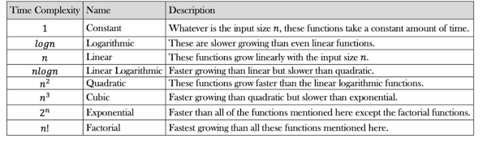

## 📊 Test Coverage

This project maintains high test coverage standards:
- **Minimum Line Coverage**: 80%
- **Minimum Branch Coverage**: 75%
- **Total Tests**: 400+
- **Success Rate**: 100%

Coverage reports are automatically generated and available in the [GitHub Actions artifacts](../../actions).

# java-data-structures
## Cheat Sheet

## Rate of growth

